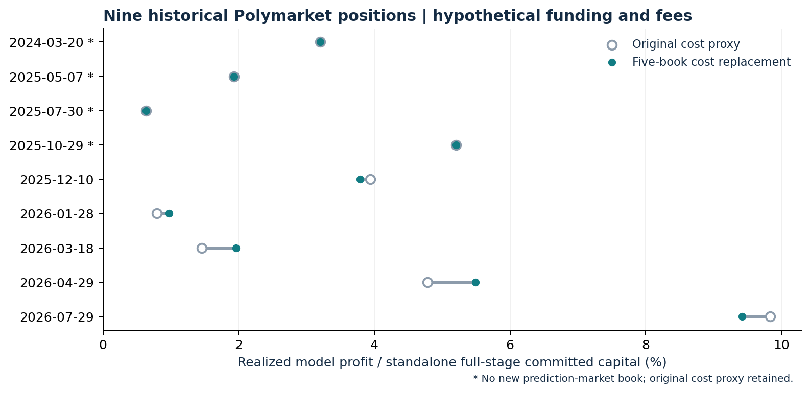

# FOMC Decision Relative Value

**Calendar-matched Fed Funds futures × prediction-market contracts**

A [Prediction@Illinois](https://prediction-illinois.github.io/) research project — quantitative trading research on prediction markets at UIUC.

[](https://github.com/YichengYang-Ethan/fed-basis-backtest/actions/workflows/public-research.yml)

[Research brief](reports/RESEARCH_BRIEF.pdf) · [Methodology](docs/METHODOLOGY.md) · [Data catalog](docs/DATA_CATALOG.md) · [Reproduce](docs/REPRODUCIBILITY.md) · [Research agenda](docs/RESEARCH_AGENDA.md) · [中文入口](README.zh-CN.md)

Can different markets assign sufficiently different values to the same Federal Reserve decision to support a useful relative-value trade? This project studies that question through contract-level payoff matching, timestamp-aware market data, transaction costs and the cash required to carry the position.

The economic link is a **ZQ calendar spread**, whose sensitivity to a FOMC decision is determined by the delivery calendar. Prediction-market digitals supply a different payoff shape. The research asks whether a matched package remains attractive after executable prices, omitted states, EFFR drift, integer hedge quantities and funding are accounted for.

The current hold-to-settlement model is a baseline for further research. The next questions concern exit timing, contract and route selection, state coverage, execution and incremental portfolio capital. A conditional two-state hedge is not a guaranteed profit across all decisions.

## Start with the question you want to answer

| Reader's question | Start here |
|---|---|
| What is the idea, and what has been built? | [Eight-page research brief](reports/RESEARCH_BRIEF.pdf) or its [text version](reports/RESEARCH_BRIEF.md) |
| How do the instruments and cash flows fit together? | [Methodology](docs/METHODOLOGY.md) and [capital / return definitions](docs/CAPITAL_AND_RETURNS.md) |
| Which data can I inspect and verify immediately? | [Public data catalog](docs/DATA_CATALOG.md) and [derived research bundle](research/depth_replay/README.md) |
| Can I run the checks without accounts or API keys? | The quick start below |
| How do I reconstruct the private data and replay? | [Reproduction guide](docs/REPRODUCIBILITY.md), [pipeline map](docs/PIPELINE_MAP.md), [private-input contract](research/depth_replay/research_source/required_private_inputs.json) |
| What should be tested next? | [Falsifiable research agenda](docs/RESEARCH_AGENDA.md) |

## Current numerical reference

The **September 20 depth-cost replay** is the reference version. Its account window runs from **February 1, 2024 to September 1, 2026**. Later data checks do not extend that return window.

| Measure | Primary model result |
|---|---:|
| Initial simulated account | $100,000 |
| Original signals / funded and settled positions | 11 / 9 |
| Ending simulated assets | **$126,510.76** |
| Cumulative account return / calendar CAGR | **26.5108% / 9.5343%** |
| Median entry conditional two-state return | **1.9276%** |
| Median realized standalone full-funding return | **3.2017%** |
| Filled entries with new prediction-market book evidence | 5 of 9 |

The nine-position account result is **ZQ + Polymarket**. Kalshi is a separately mapped venue and research dataset; it is not the source of this nine-position record. Twelve scenario configurations reuse the same events and are not twelve independent samples. Four entries retain proxy prediction-market costs. The March 2024 ladder has a known 128.5% sum anomaly. Fees, broker margins and intraday solvency are not certified. This is previously studied historical research, not an untouched holdout or live performance record. See [limitations and audits](docs/LIMITATIONS.md).



A separate [September 25 Kalshi comparison](docs/CASE_STUDY_2026-09-25.md) illustrates why a midpoint discrepancy can fail after crossing costs. It is an as-of diagnostic, not an addition to the historical account result.

## Quick start: no credentials, no market-data purchase

Python **3.10 or newer** is sufficient for the public numerical checks:

```sh
git clone https://github.com/YichengYang-Ethan/fed-basis-backtest.git
cd fed-basis-backtest
python3 research/depth_replay/model/verify_results.py
python3 research/depth_replay/model/payoff_model.py --self-test
python3 research/depth_replay/research_source/verify_source_snapshot.py
```

For the complete public-project checks:

```sh
make verify
```

These commands verify public aggregate results, return arithmetic, payoff invariants, source provenance and publication boundaries. They do not download feeds, submit trades or recreate the private cash ledger. Optional figure-generation dependencies and commands are documented in [reproducibility](docs/REPRODUCIBILITY.md).

## Project structure

```text
docs/                       Financial logic, data map, limitations and research agenda
reports/                    Public research brief and figures
research/depth_replay/       Derived results, public verifier, analytical model,
                            actual replay source and external input schemas
data_pipeline/              Source acquisition / database code and upstream builders
scripts/                    Public-project checks and reproducible figures
tests/public_project/       Public verification and analytical regression tests
.github/workflows/          Credential-free verification in GitHub Actions
harness/, data/, results/    Original September 17 study, retained as dated context
prereg/                     Historical design documents; never frozen in advance
```

The [project map](docs/PROJECT_MAP.md) separates runnable public checks, optional data acquisition and private historical replay. The original [fed-pricing-db](https://github.com/YichengYang-Ethan/fed-pricing-db) repository remains the upstream provenance source for the integrated data layer.

## Data and research integrity

Only explicitly selected derived research outputs are published. Raw CME/Databento feeds, raw settlement panels, complete third-party books, raw prediction-market histories, databases, per-leg VM ledgers, private account records and credentials are excluded. Public net-return tables do not replace the separately entitled source data needed for a full replay. See [data boundaries](docs/DATA_RIGHTS.md).

The original `prereg/` design was **never frozen before results**. No later tag or release changes that fact. Strategy variations already examined remain exploratory. Source-level and arithmetic checks are evidence about implementation; they are not proof of executable alpha.

Author: **Yicheng Yang**. Cite the version or commit you used; [CITATION.cff](CITATION.cff) supplies citation metadata. [Release history](CHANGELOG.md) distinguishes the current project from older manuscripts and capital conventions.
