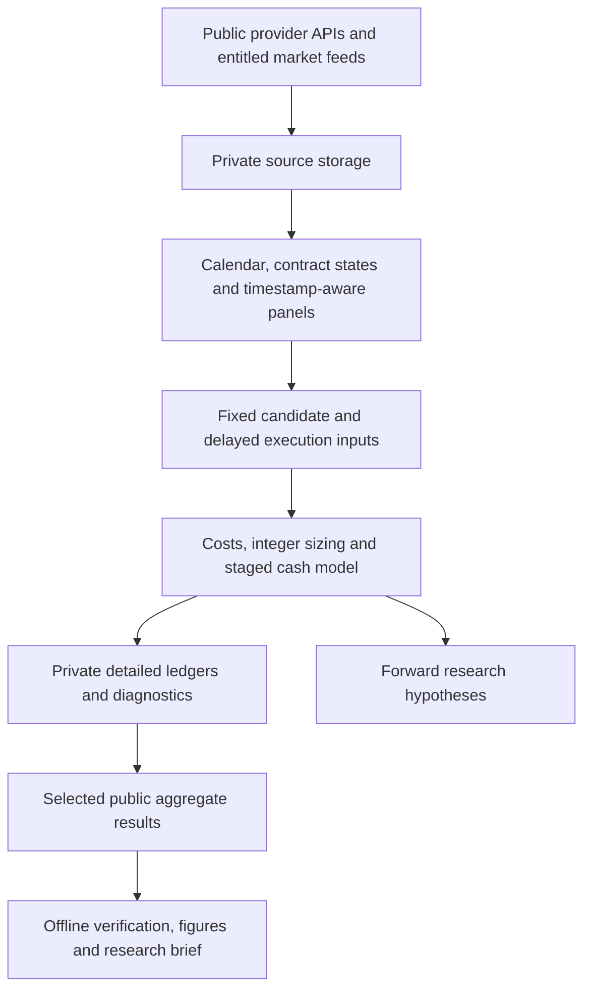

# Project map

| Component | Purpose | Runs without private feeds? |
|---|---|---|
| `research/depth_replay/model/verify_results.py` | Reconcile published derived results | Yes |
| `research/depth_replay/model/payoff_model.py` | Analytical calendar/state examples | Yes; synthetic inputs |
| `research/depth_replay/research_source/` | Actual historical replay source inspection and private-input contract | Hash/syntax checks yes; replay no |
| `data_pipeline/` | Provider acquisition, original database construction and selected upstream builders | See module-specific inputs; acquisition is optional |
| `reports/` | Public brief, chart data and figures | Public charts yes |
| `harness/`, `data/`, `results/`, `prereg/` | Original September 17 study and exploratory design | Some computations use FRED; full original harness needs its private panel |

The project consolidates the current public research surface without pretending that every historical experiment is a production pipeline. Abandoned parameter sweeps, private broker probes, bulk raw snapshots and correspondence are not release artifacts. [The research agenda](RESEARCH_AGENDA.md) identifies the next controlled experiments.
