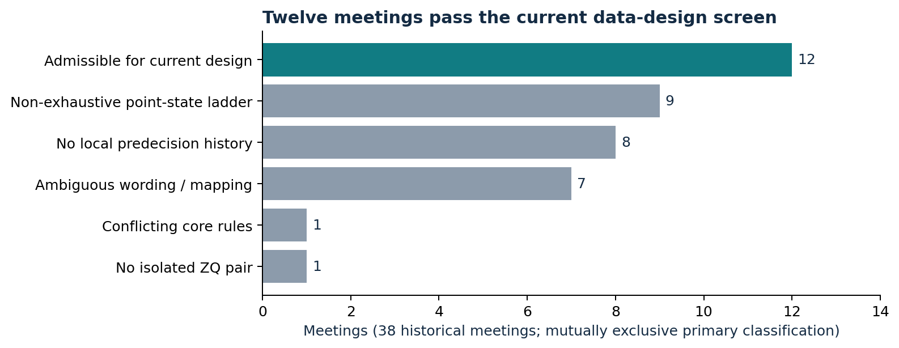
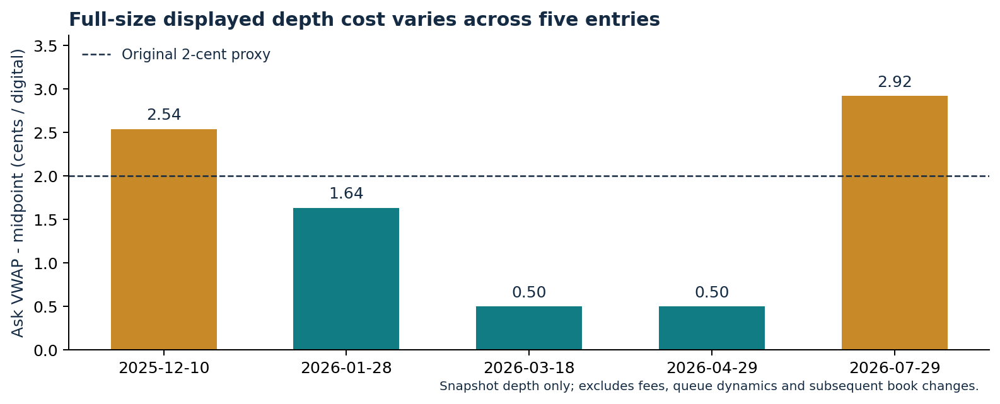

RESEARCH DISCUSSION  /  01

# Pricing one FOMC decision across two markets


ZQ calendar spreads x prediction-market digitals

**Yicheng Yang | Public research release | September 25, 2026**  
Research snapshot: September 20. Account replay ends September 1, 2026.

### The idea

Use the delivery calendar to isolate a policy decision in a Federal Funds futures spread, then compare its linear exposure with the price of a matched digital portfolio. The possible edge is a disagreement in valuation that survives contract matching, execution and funding. Market segmentation is a hypothesis to test, not an established source of alpha.

### What I have built

A data and contract-mapping layer; a calendar-based exposure model; fixed-rule intraday signal replay; a $100,000 cash and futures-margin ledger; and independent checks of payoff arithmetic, time ordering and the new depth-cost calculation.

| Current empirical baseline | Result / interpretation |
| --- | --- |
| Historical account replay | 9 settled model positions; $126,510.76 ending assets from $100,000 |
| Period-normalized result | 26.51% cumulative; 9.53% calendar CAGR, including idle time |
| New execution evidence | 5 Polymarket full-book entry snapshots; 9 ZQ entry-day depth checks |
| Venue distinction | The 9-trade result is ZQ + Polymarket. Kalshi is a mapped alternative venue, not the source of this track record. |

### The next research decision

The current hold-to-settlement design is a transparent baseline with room for further research. The next test should distinguish whether the best implementation is an event relative-value position, an earlier convergence trade, or a quoting/hedging tool - and which experiment would distinguish those uses.

**Important boundaries.** This is previously studied historical research, not live fills or an untouched holdout. Four of the nine prediction-market entries still use proxy costs. Margin and historical fee assumptions remain imperfect; two-state matching leaves tail and EFFR-basis risk.

RESEARCH DISCUSSION  /  02

## The economic link - and its limits


ZQ settles against the calendar-day mean of EFFR, with exchange rounding applied separately to each delivery month. Weekends and holidays carry the preceding applicable business-day EFFR; publication availability is tracked separately. The contract value is $4,167 per price point, or $41.67 per basis point. [S1]

Let w be the fraction of meeting month M accruing at the new rate. Under one-for-one policy transmission and no other unequal decision exposure across the two months, the ideal terminal spreads are:

```text
FRONT: S = F_M - F_(M+1) = (1-w) * D
BACK:  S = F_(M-1) - F_M = w * D
span s = 1-w or w; D in percentage points
d_CME = 100 * S / s  [decision basis points]
digital hedge per 25bp = 1,041.75 * s
```

The common EFFR level cancels; calendar exposure does not remove changes in the EFFR-policy basis, unscheduled actions or settlement rounding. A second meeting with unequal exposure disqualifies this simple construction. w=0 still permits a span-one FRONT.

### A digital is not automatically a linear hedge

For mutually exclusive, exhaustive exact-point outcomes d_j, weights proportional to d_j can reproduce a linear state payoff, with a cash adjustment. Interval buckets such as "50bp or more" do not identify a single move. A two-outcome simplification only matches the chosen two states.

| Toy policy move (bp) | Buy NO(HOLD) | Offsetting linear payoff | Combined state payoff |
| --- | --- | --- | --- |
| -50 | 1 | +2 | +3 |
| -25 | 1 | +1 | +2 |
| 0 | 0 | 0 | 0 |
| +25 | 1 | -1 | 0 |
| +50 | 1 | -2 | -1 |

Synthetic illustration, normalized per $1 digital; entry cash, fees and interest are omitted. The 0/+25bp pair matches, but +50bp loses one unit. Cheap tail quotes cannot be discarded as risk-free. A NO contract changes the state payoff, not just the number of order tickets.

### Three questions to keep separate

Does the state payoff match? Is the quoted package executable at the intended quantity? Can the cash account finance the path until each leg actually settles? A favorable answer to one does not establish the others.

RESEARCH DISCUSSION  /  03

## Data: broad collection, narrower evidence


| Layer retained locally | Coverage / role | Main limitation |
| --- | --- | --- |
| Polymarket price histories | 30 event histories; 32.07m price observations | Midpoints are not fills or historical depth |
| Kalshi historical candles | 28 meetings; 140 legs; 1,854,555 candles | Separate venue study; no comparable 9-trade account claim |
| Joint admissible opportunity panel | 12 meetings; 32,510 valid minute anchors | Meeting is the inference unit, not the minute |
| Latest ZQ depth supplement | 9 entry days + October-contract refresh | Original entry audit; not all possible exit windows |
| Telonex full Polymarket books | 5 entry-day files; 230,737 records | Coverage begins after older selected entries |
| New SR1 / SR3 statistics | 19,001,778 statistical records | Mixed statistics and revisions, not a finished policy curve |

Meeting disposition under the current design. Counts are mutually exclusive and sum to 38. Structural exclusions are not all missing-data problems.



The repository provides selected **derived research data**, definitions and review code. Licensed raw CME feeds, complete third-party books, private account records and credentials are excluded. The full backtest needs the separately listed entitled inputs; bundled-result checks run without them.

The older theory manuscript and the latest account ledger use different samples and capital denominators. This release uses the September 20 depth-cost replay as the current numerical reference, rather than mixing headline numbers across versions.

RESEARCH DISCUSSION  /  04

## Baseline model and time discipline


| Step | Rule retained in this replay |
| --- | --- |
| Admissibility | Calendar-isolated months, interpretable contract states, next-meeting window and quote-liveness checks |
| First signal | Reference T5_E4_P3: each omitted outcome quoted <=5 cents, legacy edge >=4 cents, three adjacent minute anchors |
| Execution attempt | Wait 60 seconds; lock token, direction, hedge ratio, futures months and route; do not retry a failed signal at a better later time |
| Size | Evaluate every integer quantity within locked CME BBO capacity; use cumulative ask-book cost where available; maximize the two-main-state net payoff floor subject to cash constraints |
| Hold / cash | Daily futures VM, separate digital payment, near-leg expiry and far-leg expiry; no credit for a future digital payout |
| Accounting | Keep all 11 original signals, including missing-data and funding rejections; preserve pending positions if any |

### Inputs that remain assumptions

Main comparison: $330 initial / $300 maintenance per eligible paired spread; $1,100 / $950 for an unpaired contract. These are hypothetical collateral rules, not historical IBKR account quotes. The $904.153 single-leg maintenance reference is reported separately as a sensitivity, never silently spliced into the main result.

Fees retain 0.05 x Q x p x (1-p), calculated by price level, plus $5 per ZQ package. Without a new book, digital cost remains midpoint plus two cents. Historical fee versions and actual all-in execution bills are not certified.

### Why initial margin is not the full capital denominator

```text
support = max(current initial margin,
    max_over_scenarios_and_stages(
        stage maintenance - prior cash flows))
entry cash = digital premium + modeled costs on both venues
trade ROI = net settled profit / (entry cash + support)
```

Support uses the preceding 60 common, available observations and 1-5-interval cash scenarios with expiry transitions. It is an empirical liquidity model, not a worst-case solvency bound or SPAN. Near-month expiry can leave an outright far-month exposure even when opening spread margin is small.

The 5-cent filter is per outcome, not an aggregate tail-probability bound. Known exception retained: the March 2024 selected ladder totals 128.5%. It is flagged in the data; numerical replay is not evidence that this anomalous observation was a clean trade. Parameters were previously explored, so strict timestamp logic does not make the sample out-of-sample.

RESEARCH DISCUSSION  /  05

## Latest results: a cost-model refinement


| Same $100,000 account | Ending assets | Cumulative | Calendar CAGR |
| --- | --- | --- | --- |
| Original midpoint + 2c | $126,399.40 | 26.3994% | 9.4969% |
| New books replace 2c | $126,510.76 | 26.5108% | 9.5343% |
| New books + extra 2c | $123,765.82 | 23.7658% | 8.6077% |

Window: February 1, 2024 to September 1, 2026; same 330/300 paired and 1,100/950 outright margin assumptions. New book costs apply only to five covered entries. The extra-2c row retains an additional allowance on those five, not a universal fee change.

Nine settled model entries, sorted by meeting date. * No new PM depth: original proxy cost retained. Returns include full-stage modeled funding; no probability or performance interval is implied.


The main update adds **approximately $111** to total profit and leaves the 414-package allocation unchanged. All-nine trade ROI median remains **3.2017%**; the middle observation is an unchanged proxy-cost trade. Within the same five book-covered trades, the median moves from 3.9405% to 3.7905%.

All nine settled model profits are positive; nine observations are insufficient to estimate a reliable future win rate or loss-payoff ratio. The year-normalized number is historical arithmetic, not a prospective return forecast.

RESEARCH DISCUSSION  /  06

## What the new depth actually changes


Static displayed ask-book cost at the original account quantities, excluding fees. The original uniform allowance was conservative for three entries and optimistic for two.



### Execution and size

The July 2026 account position required four displayed ask levels; the December 2025 entry required six. The first quoted level alone therefore misrepresents the cost of the intended positions. Exact historical position sizes and book levels remain outside this public projection. Visible depth is not a fill guarantee: quotes can cancel, and venues cannot be traded atomically.

All nine ZQ positions fit the displayed BBO at the original execution snapshots. Only five had both quote clocks less than one second old; several were approximately 12-14 seconds old under the retained 60-second limit. Synthetic legs can have asynchronous execution and implied liquidity can overlap.

### Funding is still a structural research question

The current model holds both futures legs to settlement. In a BACK structure, the near month can expire before the target meeting. The remaining far month then consumes outright margin and has a different VM path. Earlier exits may reduce this burden, but require a new market-price convergence test rather than the terminal-payoff argument.

### What has been checked

The prior local audit covered 12 scenario runs of the same small event sample, private cash ledgers, nonlinear costs and 618,702 candidate integer quantities. Poisoning 97,244 future book records left the selected entry books unchanged. The public verifier checks aggregate profit, ROI, CAGR and source integrity; it cannot repeat the private ledger or book audit without entitled inputs.

Twelve dataset-level degraded days affect the purchased SOFR window; no such dates intersect the nine ZQ entry days or the new October ZQ window. SOFR is not used to select trades in this account result.

RESEARCH DISCUSSION  /  07

## Research space: test structures before tuning


These are research proposals, not claimed performance improvements. Compare a small, economically motivated set on the same events and information set, then freeze the chosen rules before new observations arrive.

| Priority / hypothesis | Controlled experiment | What would reject it |
| --- | --- | --- |
| 1. Exit horizon and funding | Compare terminal hold with fixed announcement-relative and pre-near-expiry exits. Measure net P&L, dollar-days, cash troughs and incomplete fills. | Exit costs or non-convergence outweigh released capital; no improvement in paired event comparisons. |
| 2. Contract and execution route | Within calendar-clean choices compare FRONT/BACK and listed/synthetic routes at common clocks and equal policy exposure. | Apparent gain comes from stale quotes, shared implied depth, contaminated months or unequal tail risk. |
| 3. YES / NO and state coverage | Price actual tokens and explicit state-payoff matrices; compare two-state positions with wider ladders or defined tail hedges. | Protection cost consumes the edge, or interval buckets leave unbounded/unpriced residual states. |
| 4. Nonlinear execution and sizing | Walk both books with latency and partial-fill rules. Optimize contemporaneous dollar edge subject to depth and cash, not capital utilization alone. | Benefit vanishes at attainable size or requires implausible same-instant fills. |
| 5. EFFR residual and second curve | Decompose policy exposure from EFFR drift; clean SR1/SR3 statistics and map their averaging/compounding before comparison. | Added SOFR-EFFR basis, mismatched meetings or costs exceed the information/hedge benefit. |

### Prospective validation

Record every eligible and rejected signal, not only eventual winners. Fix the event universe, entry/exit clocks, model versions and capacity target before evaluation. Use meetings as blocks; keep exploratory results separate from forward shadow fills. Collect dates based on the protocol, not the size of historical profit.

The best next dataset is synchronized quote/depth and order-lifecycle evidence for the actual implementation being tested. The five new books improve the current entry audit but cannot evaluate arbitrary exit times or all alternative tokens.

RESEARCH DISCUSSION  /  08

## Research questions and review path


### Open implementation questions

**Mandate:** Is the promising use case event relative value, convergence trading, or a fair-value input for quoting? Which residual risks should earn compensation, and which must be hedged away?

**Implementation:** Which prediction venue and futures routes can the desk actually access? What minimum dollar edge, deployable size, completion rate and cash-at-risk would justify further work?

**Next experiment:** Should the first controlled test focus on exit timing, real incremental FCM capital, or synchronized execution? Which result would falsify the investment case?

### How to inspect the repository

| Folder / file | Purpose |
| --- | --- |
| README.md | Reading order, current numerical baseline and version boundaries |
| docs/DATA_CATALOG.md | Derived results, coverage, field definitions and disclosure boundaries |
| research/depth_replay/ | Derived CSVs, offline result verification and analytical payoff examples |
| data_pipeline/ | Data acquisition and upstream builders; entitled private-input instructions |
| docs/RESEARCH_AGENDA.md | Hypotheses, data needs, rejection conditions and anti-overfit rules |
| PUBLICATION_MANIFEST.json | Publication inventory, content hashes and PDF text-scan receipt |

Public checks reconcile the delivered aggregate results, not the excluded per-leg cash ledger or licensed raw-feed history. A full rerun needs the documented private schemas, entitled data and staged builders. The project is a research artifact with no live order execution.

### Source anchors

[S1] CME CBOT Rulebook, Chapter 22: [contract economics and final settlement](https://www.cmegroup.com/rulebook/CBOT/III/22.pdf).  
[S2] Federal Reserve Bank of New York: [EFFR methodology and publication](https://www.newyorkfed.org/markets/reference-rates/effr).  
[S3] Kalshi API: [YES/NO order-book interpretation](https://docs.kalshi.com/getting_started/orderbook_responses).  
[L] September 20 fixed-rule depth replay and prior local audit; source snapshots and public verification scope are documented in the repository.

Public project context: [analysis repository](https://github.com/YichengYang-Ethan/fed-basis-backtest) and [data-layer repository](https://github.com/YichengYang-Ethan/fed-pricing-db). This consolidated release includes code and selected derived results. Raw inputs require separate entitlements; public checks run offline.